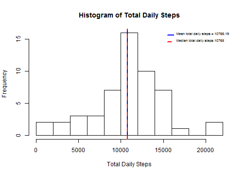
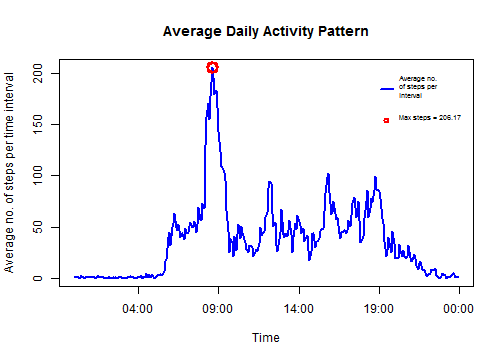
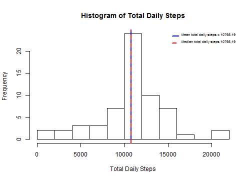
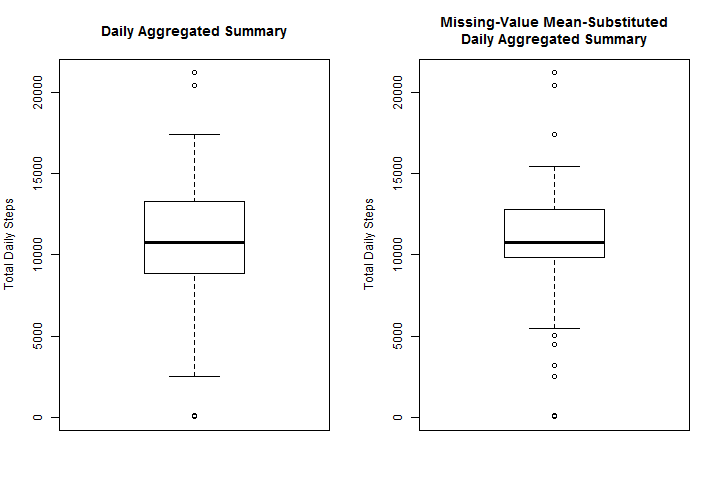
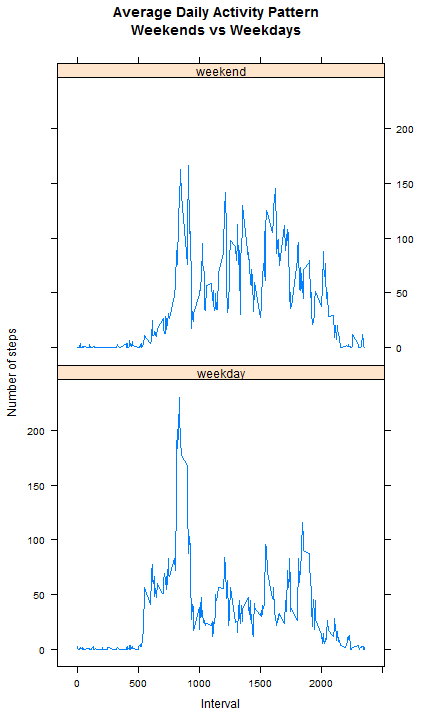

## Loading and preprocessing the data

```r
unzip("activity.zip")
stepsDataOrig <- read.csv("activity.csv", header = TRUE)
#filter out the invalid values in "steps" variable
stepsData <- stepsDataOrig[!is.na(stepsDataOrig$steps),]
```

## What is mean total number of steps taken per day?

We can find the total steps per day as a daily aggregate of the total number of steps. Using this, we can then find the mean and median total number of steps taken per day.


```r
#Get the aggregated total steps grouped by date
stepsDailyAggregate <- aggregate(x = stepsData$steps, 
                                 by = list(stepsData$date),  
                                 FUN = function(x){sum(as.numeric(x))})

par (mfrow = c(1, 1))

#output the aggregated daily steps data to histogram
hist(stepsDailyAggregate$x, 
     n = 15,
     main = "Histogram of Total Daily Steps",
     xlab = "Total Daily Steps")

#add a vertical solid blue line to show the mean value
abline(v = mean(stepsDailyAggregate$x),
       lty = "solid",
       lwd = 2,
       col = "blue")

#add a vertical dashed red line to show the median value
abline(v = median(stepsDailyAggregate$x), 
       lty = "dashed",
       lwd = 2,
       col = "red")

#turn off clipping, as legends with long text tend to get clipped
par(xpd=TRUE)

#add a legend to indicate the line purposes
legend("topright", 
     lty=c("solid","dashed"),
     lwd=c(2,2),
     col = c("blue", "red"),
     bty = "n",
     legend = c(paste("Mean total daily steps =",
                      round(mean(stepsDailyAggregate$x), digits=2),
                      "\n"), 
                paste("Median total daily steps",
                      round(median(stepsDailyAggregate$x), digits = 2),
                      "\n")),
     cex=0.60, pt.cex = 1)
```



```r
#turn clipping on again
par(xpd=FALSE)
```

The mean total number of steps taken per day is **10766.19** steps.


## What is the average daily activity pattern?

```r
#Get the interval aggregated average number of steps
stepsIntervalAggregate <- aggregate(x = stepsData$steps, 
                                 by = list(stepsData$interval),  
                                 FUN = function(x){mean(as.numeric(x))})

#convert the intervals into a time series
intervalTimes <- strptime (sprintf("%04d", stepsIntervalAggregate$Group.1),
                          format = "%H%M")

#Add the time series to the aggregated data
stepsIntervalAggregate <- cbind(stepsIntervalAggregate, intervalTimes)

#plot the average steps per interval on a time series plot (line-type)
plot(stepsIntervalAggregate$intervalTimes, 
     stepsIntervalAggregate$x,
     main = "Average Daily Activity Pattern",
     xlab = "Time",
     ylab = "Average no. of steps per time interval",
     col = "blue",
     lwd = c(2),
     type = "l")

#add a red circle at the maximum point
maxStepsIntervalPoint <- stepsIntervalAggregate[stepsIntervalAggregate$x == max(stepsIntervalAggregate$x),]

points(maxStepsIntervalPoint$intervalTimes, 
       maxStepsIntervalPoint$x, 
       col = "red",
       cex = 2,
       pch = 1,
       lwd = 3)

#turn off clipping, as legends with long text tend to get clipped
par(xpd=TRUE)

#add a legend
legend("topright", 
     lty = c("solid", NA),
     pch = c(NA, 1),
     lwd = c(2, 2),
     col = c("blue", "red"),
     bty = "n",
     legend = c(paste("Average no.    \nof steps per    \ninterval    ",                    
                      "\n"),
                paste("Max steps =", round(maxStepsIntervalPoint$x[1], digits=2), "    \n     ")),
     cex = 0.60, 
     pt.cex = 1)
```



```r
#turn clipping on again
par(xpd=FALSE)
```

The maximum average number of steps taken per interval is **206.17** steps, at **08:35**.


## Imputing missing values

The original data in 'activity.csv' has **2304** observations (i.e. intervals) that have missing values (i.e. 'NA').

So as not to affect the daily activity pattern, the mean value across all of the days for the corresponding interval should be used for *"filling in all of the missing values in the dataset"*. (N.B: Mean-Subsitution reduces data characterisitics such as variance. However, for the purposes of this assessment this method of missing-data substitution will be assumed okay)

The code to do this is as follows:


```r
#copy the original data
stepsDataOrigSubs <- stepsDataOrig

#loop through the data frame, and mean-susbtitute the steps values for any missing data
for(i in 1:nrow(stepsDataOrigSubs))
{
  if (is.na(stepsDataOrigSubs$steps[i]))
  {
    stepsDataOrigSubs$steps[i] <- stepsIntervalAggregate$x[stepsIntervalAggregate$Group.1 ==
                                    stepsDataOrigSubs$interval[i]]
  }  
}
```


```r
#Get the aggregated total steps grouped by date
stepsSubsDailyAggregate <- aggregate(x = stepsDataOrigSubs$steps, 
                                 by = list(stepsDataOrigSubs$date),  
                                 FUN = function(x){sum(as.numeric(x))})
#output the aggregated daily steps data to histogram
hist(stepsSubsDailyAggregate$x, 
     n = 15,
     main = "Histogram of Total Daily Steps",
     xlab = "Total Daily Steps")

#add a vertical solid blue line to show the mean value
abline(v = mean(stepsSubsDailyAggregate$x),
       lty = "solid",
       lwd = 2,
       col = "blue")

#add a vertical dashed red line to show the median value
abline(v = median(stepsSubsDailyAggregate$x), 
       lty = "dashed",
       lwd = 2,
       col = "red")

#turn off clipping, as legends with long text tend to get clipped
par(xpd=TRUE)

#add a legend to indicate the line purposes
legend("topright", 
     lty=c("solid","dashed"),
     lwd=c(2,2),
     col = c("blue", "red"),
     bty = "n",
     legend = c(paste("Mean total daily steps =",
                      round(mean(stepsSubsDailyAggregate$x), digits=2),
                      "\n"), 
                paste("Median total daily steps",
                      round(median(stepsSubsDailyAggregate$x), digits = 2),
                      "\n")),
     cex=0.60, pt.cex = 1)
```



```r
#turn clipping on again
par(xpd=FALSE)
```

The mean total number of steps taken per day is **10766.19** and the median total number of steps taken per day is **10766.19** when missing data is mean-substituted.

The missing value mean-substitution results in a different median value for the updated values compared to the original missing value ommitted values.

A comparison of the data summaries also indicates some differences: 


```r
#output the initial daily aggregate summary
summary(stepsDailyAggregate$x)
```

```
##    Min. 1st Qu.  Median    Mean 3rd Qu.    Max. 
##      41    8841   10760   10770   13290   21190
```

```r
#output the missing-value mean-substituted daily aggregate summary
summary(stepsSubsDailyAggregate$x)
```

```
##    Min. 1st Qu.  Median    Mean 3rd Qu.    Max. 
##      41    9819   10770   10770   12810   21190
```

```r
par (mfrow = c(1, 2))
boxplot(stepsDailyAggregate$x,
        main="Daily Aggregated Summary",
        ylab="Total Daily Steps")
boxplot(stepsSubsDailyAggregate$x,
        main="Missing-Value Mean-Substituted\nDaily Aggregated Summary",
        ylab="Total Daily Steps")
```



## Are there differences in activity patterns between weekdays and weekends?


```r
#Get the day of the week for each value in the 'date' column
dayType <- weekdays(as.Date(stepsDataOrigSubs$date, 
                     format = "%Y-%m-%d"))

#Make a factor variable, with levels False and True depending on whether it is a weekend or not
dayType <- as.factor(grepl("Saturday", dayType) | grepl("Sunday", dayType))

#rename the factor levels to be meaningful
levels(dayType) <- c("weekday", "weekend")

#add the factor as a column to the steps data
stepsDataOrigSubs <- cbind(stepsDataOrigSubs, dayType)

#Get the interval aggregated average number of steps for weekends and weekdays
dayTypeIntervalAggregate <-  aggregate(x = stepsDataOrigSubs$steps, 
                                 by = list(stepsDataOrigSubs$dayType, stepsDataOrigSubs$interval),  
                                 FUN = function(x){mean(as.numeric(x))})

#convert the intervals into a time series
intervalTimes2 <- strptime (sprintf("%04d", dayTypeIntervalAggregate$Group.2),
                          format = "%H%M")

dayTypeIntervalAggregate <- cbind(dayTypeIntervalAggregate, intervalTimes2)

#if needed, please install the 'lattice' package
library(lattice)

# xyplots by factor level 
# xyplot(dayTypeIntervalAggregate$x~dayTypeIntervalAggregate$Group.2|dayTypeIntervalAggregate$Group.1, 
#     main="Average Daily Activity Pattern\nWeekends vs Weekdays",
#     xlab="Interval",
#     ylab="Number of steps",
#     type = "l",
#     layout=c(1,2))
xyplot(dayTypeIntervalAggregate$x~dayTypeIntervalAggregate$intervalTimes2|dayTypeIntervalAggregate$Group.1, 
    main ="Average Daily Activity Pattern\nWeekends vs Weekdays",
    xlab ="Time",
    ylab ="Number of steps",
    lwd = 2,
    scales=list(
     x=list(at= seq(as.POSIXct(dayTypeIntervalAggregate$intervalTimes2[1]), by="6 hour", length=5), 
     labels=format(seq(as.POSIXct(dayTypeIntervalAggregate$intervalTimes2[1]), by="6 hour", length=5),
                   "%H:%M"))),
    type = "l",
    layout=c(1,2))
```


